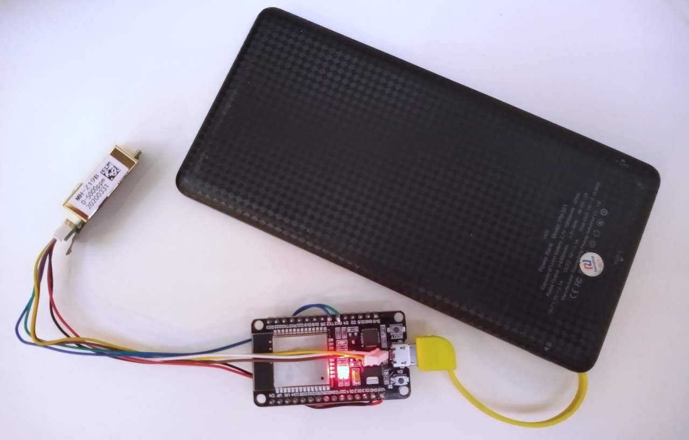
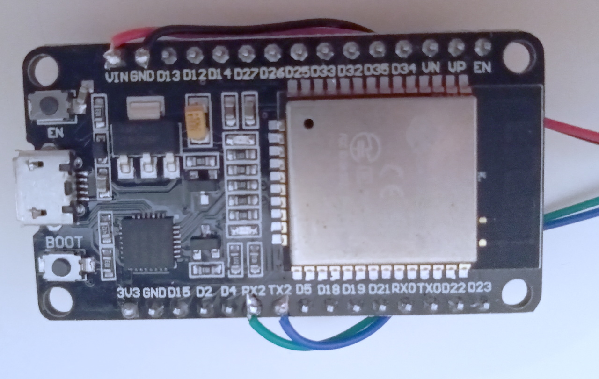
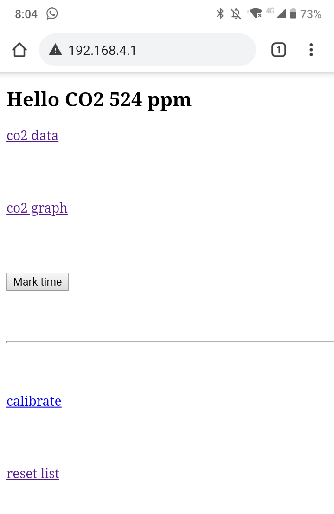
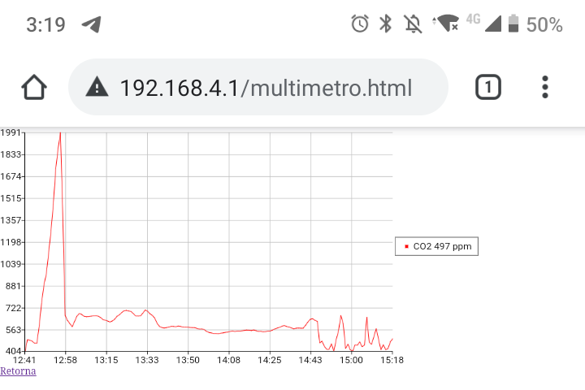

# co2meter

A cheap and dirty CO2 meter using MH-Z19B sensor (US$20) and ESP32-WROOM devkit board (US$5). With the addition of an USB powerbank you get a portable CO2 meter reporting directly to your smartphone using WIFI.

This is a quite useful gadget to have for the Covid-19 pandemic. Since CO2 level is a good [infection risk proxy](https://www.medrxiv.org/content/10.1101/2020.09.09.20191676v1) as "how many times has this air been breathed before" you may use it to survey the places you go in order to leave ASAP those dangerous, poorly ventilated spaces.

## Assembling

Only four wires are needed to connect the MH-Z19B to ESP32 as shown in picture below. It is easier buying the MH-Z19B with cable option as the colors will be same used here.

- VIN pin (5 Volts directly from USB connector) - Red wire.
- GND pin - Black wire.
- RX2 (ESP32 Serial2 RX) - Green wire [notice: this is the MH-Z19B's **TX** pin]
- TX2 (ESP32 Serial2 TX) - Blue wire [notice: this is the MH-Z19B's **RX** pin]

## Installation

In order to install co2meter on your ESP32 module you need the following software:

- [Arduino PlatformIO](https://platformio.org/install)
- [ESPAsyncWebServer](https://github.com/me-no-dev/ESPAsyncWebServer#installation)
- [MH-Z19 library](https://platformio.org/lib/show/6091/MH-Z19)

Then get a copy of co2meter repository using git, or download the [zip file](https://github.com/miguelfreitas/co2meter/archive/main.zip), and open it as a PlatformIO project. You need to upload both the code and the filesystem image (containing some static HTML/Javascript files).

1. PlatformIO: Project tasks, Upload Filesystem Image.
2. PlatformIO: Upload and Monitor (check console for errors)
3. Select wifi network "co2meter" (password "meterco2")
4. Open http://192.168.4.1 on your mobile browser.

## Usage

All co2meter pages are pretty crude. The root page looks like this:

Instead of "Hello world" here we have "Hello CO2" with latest sensor data. Refresh page to update.

- **co2 data** - downloads CO2 data history as csv. 
- **co2 graph** - displays the CO2 history as graph.
- **mark time** - add an (event) marker into CO2 data. Maker is a value > 10000 such as 1HHMM for hour:minute the marker was set.
- **calibrate** - use this option to fix the "zero" of the MH-Z19B by leaving it outdoors for 20 minutes. The measurement over this time will be your new 400 ppm reference.
- **reset list** - clear CO2 data history.

The CO2 data history is a circular buffer containing the last 1024 values, unless cleared. In case of poweroff/reboot only the last 255 values are kept (the EEPROM capacity). Values are in ppm as returned from the sensor except for 0 (reboot marker) or > 1xxxx values for time markers.

CO2 graph looks like this:

## Caveats

- Sometimes my Android phone refuses to communicate with co2meter after reconnecting WIFI. To fix this I have to ask it to "Forget network" and then enter password again. Looks like an Android bug to me.
- MH-Z19B does a pretty decent job for measuring CO2 except for absolute reference level which is supposedly 400 ppm for the calibration procedure. Since I only care about additional indoor CO2 due to breathing I always try to register the actual street value before entering some place.

